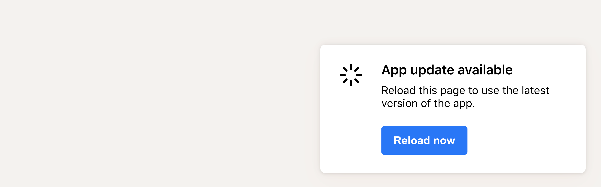

# react-update-popup

**Ask users to refresh when there is a new version of the app available.**

[](https://www.npmjs.com/package/react-update-popup)


## Install

Works out of the box for create-react-app apps.

```bash
yarn add react-update-popup
# or: npm install --save react-update-popup
```


## Usage

```tsx
import React, { Component } from 'react'

import { UpdateNotification } from 'react-update-popup'
import 'react-update-popup/dist/index.css'

const Example = () => (
  <UpdateNotification />
)
```


## Styling

By default, the popup looks like this:



Update it to fit within your application by:

* Using the component props to change the text of the popup
* Adding custom CSS for class `.update-notification-popup` to restyle the popup


## Props

All props are optional, and can be used to change the appearance of the popup.

* string `title` - popup title, wrapped in `<h3>`
* string `description` - popup description text, wrapped in `<p>`
* string `buttonText` - button text
* string `assetManifestUrl` - this is how we check if the React app has been updated, defaults to `/asset-manifest.json`
* function `onReload` - replace default reload behaviour


## License

MIT © [flexible-agency](https://github.com/flexible-agency)
